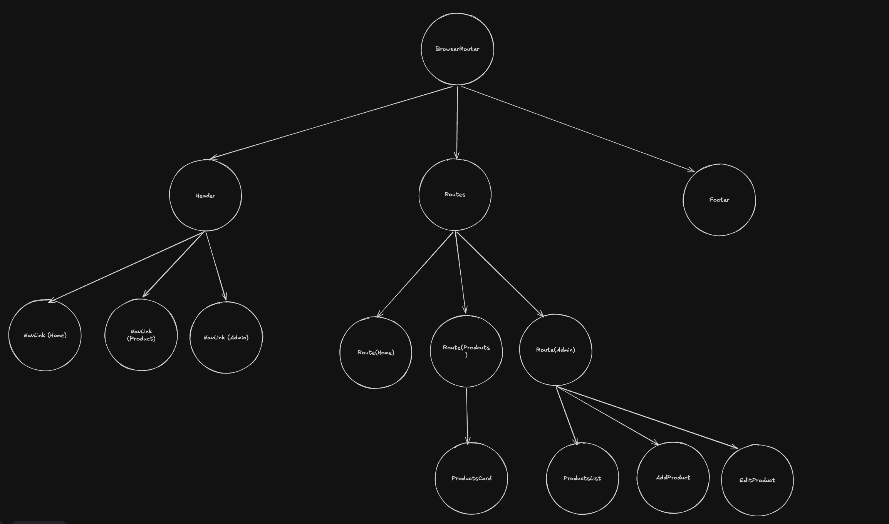

# Kappa Alpha Wellness Store

##  Project Introduction
**Kappa Alpha Wellness Store** is a web application designed to democratize access to healthcare infrastructure for the everyday user ("mwananchi"). Recognizing that affordable medication is vital to both human well-being and economic stability, this platform bridges the accessibility gap by offering an intuitive, fast, and budget-friendly digital pharmacy experience.

The application is engineered using **React** and **Vite** for a high-performance frontend interface, backed by a **JSON Server** mock database ecosystem.

---

##  Project Setup

Ensure you have [Node.js](https://nodejs.org) installed before proceeding.

1. **Install Dependencies:**
   ```bash
   npm install
   ```
2. **Launch the Local Development Server:**
   ```bash
   npm run dev
   ```
   *Open the network URL provided in your terminal output to view the app in your browser.*
3. **Launch the JSON Backend Database:**
   ```bash
   npm run server
   ```
   *This initializes the mock database endpoint allowing real-time data persistence.*

---

##  React Hooks Architecture

State management and global reactive data streams are handled via native and abstract React hooks.

| Hook | Architectural Purpose |
| :--- | :--- |
| **`useState`** | Manages local UI states, input form bindings, and independent component-level memory allocations. |
| **`useEffect`** | Handles synchronous and asynchronous side effects. It orchestrates the initial data fetching operations from the JSON server database immediately after components mount to the DOM tree.|
| **`useContext`** | Drives global state distribution. It provides deeply nested components access to centralized drug data catalogs and CRUD functionalities without prop-drilling. |
| **`useMemo`** | Caches expensive runtime arithmetic. It dynamically computes total cart pricing arrays only when item quantities or core additions modify the dependencies, preventing unnecessary re-renders. |
| **`useCart`**| A custom hook encapsulating localized shopping operations (add/remove items, checkout toggles, total item counts). This abstracts complex transactional operations away from the presentation layers. |

---

## Component Tree Structure
The architectural node graph below maps out the application's layout hierarchy and structural composition.



## Live Demo Link
[Kappa Alpha Wellness Store](https://kappa-alpha-ecom-website.vercel.app/)
